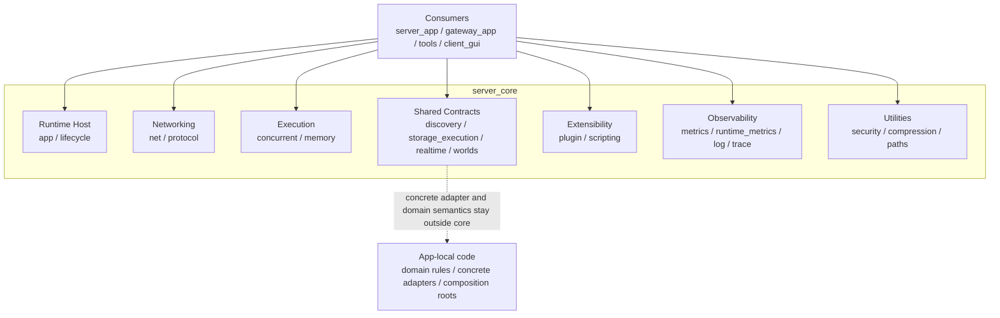

# 코어 라이브러리(server_core)

`core`는 Dynaxis의 공용 실행 플랫폼이다. `server_app`, `gateway_app`, 각종 tools가 공통으로 써야 하는 runtime host, transport substrate, bounded execution primitive, observability substrate, 그리고 domain-neutral contract를 모아 둔 C++20 라이브러리다.

## 읽기 순서

- current-state layering: `docs/core-design.md`
- deep rationale: `docs/core-architecture-rationale.md`
- public API map: `docs/core-api/overview.md`
- boundary inventory: `docs/core-api-boundary.md`

## 아키텍처 개요



## current-state 요약

### Runtime Host

- `core/app/*`
- `AppHost`, `EngineBuilder`, `EngineContext`, `EngineRuntime`
- 공통 lifecycle, readiness, dependency state, admin HTTP, shutdown 규약을 소유한다.

### Networking

- `core/net/*`, `core/protocol/*`
- reusable transport substrate는 `Hive`, `Listener`, `Connection`
- current packet-session implementation은 internal `Session`
- `Dispatcher`와 `OpcodePolicy`가 transport/state/processing-place policy를 적용한다.

### Execution / Memory

- `core/concurrent/*`, `core/memory/*`
- `JobQueue`, `ThreadManager`, `TaskScheduler`, `MemoryPool`, `BufferManager`
- 핵심 목표는 최대 성능보다 bounded semantics와 predictable overload behavior다.

### Observability

- `core/metrics/*`, `core/runtime_metrics.hpp`, `core/util/log.hpp`, `core/trace/*`
- process-wide counters, Prometheus export, hardened admin HTTP, async logging, trace correlation을 제공한다.

### Shared Contracts

- `core/discovery/*`
- `core/storage_execution/*`
- `core/realtime/*`
- `core/worlds/*`

공용 contract는 canonical public path로 노출하고, underlying implementation이나 concrete adapter는 별도 내부/앱 경계에 남긴다.

### Extensibility

- `core/plugin/*`, `core/scripting/*`
- service-neutral mechanism은 core가 소유한다.
- chat-specific ABI와 bindings는 core 밖에 둔다.

## boundary rules

- `core/`는 `server/` 또는 `gateway/` 구현을 include하지 않는다.
- stable public contract와 internal implementation은 구분한다.
- consumer-facing canonical 이름은 `Listener`, `Connection`, `discovery/**`, `storage_execution/**`, `realtime/**`, `worlds/**`다. alias나 underlying 경로는 current public entrypoint로 보지 않는다.
- concrete Redis / Consul / Postgres adapter, sticky routing, 채팅 도메인 규칙은 core 밖에 둔다.
- 새 public surface는 "구현"보다 "공용 contract"인지 먼저 따진다.

## 빌드

```powershell
pwsh scripts/build.ps1 -Config Debug -Target server_core
ctest --preset windows-test
```
