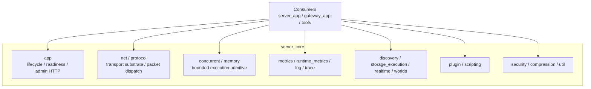

# [심층 분석] `server_core` current-state 아키텍처

이 문서는 `server_core`가 왜 지금 같은 구조를 가지는지, 각 계층이 어떤 현실적인 압력 때문에 분리되었는지, 그리고 그 경계를 무너뜨리면 어떤 유지보수 문제가 생기는지를 설명한다.

이 문서는 "코드를 한 줄씩 따라가는 해설"이 아니라 "왜 이 라이브러리가 이렇게 생겼는가"에 대한 설계 배경 문서다.

함께 읽으면 좋은 문서:

- [`core/README.md`](./README.md): 모듈 진입점
- [`docs/core-design.md`](../docs/core-design.md): current-state 레이어 지도
- [`docs/core-architecture-rationale.md`](../docs/core-architecture-rationale.md): canonical rationale
- [`docs/core-api/overview.md`](../docs/core-api/overview.md): 공개 surface 읽기 순서

## 1. `server_core`는 무엇인가

한 문장으로 정리하면, `server_core`는 "여러 바이너리가 공통으로 써야 하는 실행 플랫폼"이다.

이 설명이 중요한 이유는, core를 두 가지로 오해하기 쉽기 때문이다.

- 오해 1
  - "그냥 공용 유틸 모음"
- 오해 2
  - "이미 완성된 채팅 서버 엔진"

둘 다 정확하지 않다.

### 1.1 공용 유틸 모음만은 아닌 이유

core는 문자열 헬퍼나 작은 함수 모음 수준을 넘는다. lifecycle, readiness, metrics, packet transport, bounded execution, topology contract처럼 "프로세스가 살아 움직일 때 의미를 갖는 규약"을 소유한다.

### 1.2 완성된 제품 엔진은 아닌 이유

반대로 core는 room rule, chat ABI, sticky session directory, concrete Redis/Postgres adapter, provider SDK 결합을 소유하지 않는다. 그런 것은 제품별 또는 배포별 의미라서 app-local에 남긴다.

즉, core는 "범용 제품"이 아니라 "재사용 가능한 실행 플랫폼"이다.

## 2. 이 구조를 강제한 현실적 문제들

### 2.1 여러 프로세스가 같은 운영 규약을 공유해야 했다

Dynaxis에는 `server_app`, `gateway_app`, `wb_worker`, 기타 tool이 공존한다. 이들이 readiness, shutdown, logging, admin HTTP, metrics를 각자 다른 방식으로 구현하면 운영이 곧바로 흔들린다.

예를 들면:

- 어떤 프로세스는 종료 시 바로 내려가고
- 어떤 프로세스는 `ready=false`를 늦게 내리고
- 어떤 프로세스는 `/metrics`를 안 열고
- 어떤 프로세스는 dependency 상태를 외부에 드러내지 않는다

이 차이는 코드 취향 차이가 아니라 운영 사고의 원인이 된다. 그래서 lifecycle과 observability 규약은 공통 substrate로 core에 들어왔다.

### 2.2 공용 contract와 구현 세부를 분리해야 했다

처음에는 "공용으로 쓸 것 같은 헤더를 그냥 열어 두자"는 방식이 빠르다. 하지만 package로 export하는 순간 그 태도가 위험해진다.

- 외부 consumer는 어떤 이름이 canonical인지 알아야 한다.
- 내부 구현 경로는 계속 바뀔 수 있어야 한다.
- 모든 helper를 public으로 만들면 사실상 영구 지원 부담을 떠안게 된다.

이 문제 때문에 core는 Stable, Transitional, Internal 경계를 강하게 가지게 되었다.

### 2.3 성능보다 더 큰 문제는 경계 붕괴였다

많은 서버 코드는 "성능이 중요하니 공용화하자"에서 시작한다. Dynaxis는 그 단계를 지나 "공용화하면 안 되는 것까지 public에 밀어 넣지 말자"가 더 중요한 상태다.

예를 들어 generic TCP `Connection`과 packet-aware `Session`은 비슷해 보여도 의미가 다르다. 둘을 섞으면 단기적으로는 편해도, gateway나 future consumer가 generic transport만 쓰고 싶을 때 public surface가 server-specific semantics로 오염된다.

즉, 현재 구조는 성능 최적화보다 경계 보존을 더 우선한 결과다.

## 3. 레이어 지도

이 레이어링의 목적은 "비슷한 파일끼리 묶기"가 아니다. 어떤 책임이 어느 높이에서 결정되어야 하는지 분명히 하는 데 있다.

## 4. `core/app`이 필요한 이유

`core/app`은 `EngineBuilder`, `EngineRuntime`, `EngineContext`, `AppHost` 같은 조립/lifecycle 표면을 제공한다.

초보자에게는 "각 앱이 자기 `main()`에서 알아서 만들면 되지 않나?"라는 생각이 자연스럽다. 하지만 그렇게 하면 다음 문제가 반복된다.

- dependency 선언 방식이 앱마다 달라진다.
- readiness/liveness 의미가 제각각이 된다.
- signal 처리와 shutdown 순서가 일관되지 않다.
- admin HTTP 표면(`/metrics`, `/healthz`, `/readyz`)이 프로세스마다 조금씩 달라진다.

즉, `core/app`은 편의 기능이 아니라 "운영 규약을 강제하는 공통 조립층"이다.

### 4.1 `EngineContext`가 기준이고 global registry가 아닌 이유

`EngineContext`는 instance-scoped typed registry다. 이것이 필요한 이유는 같은 프로세스 안에서 여러 runtime을 띄우거나, 테스트에서 runtime 격리를 유지하려면 process-global singleton만으로는 부족하기 때문이다.

global lookup만 쓰면 다음 문제가 생긴다.

- 테스트 간 상태 누수
- 하나의 runtime이 다른 runtime의 global entry를 덮어씀
- shutdown 시 누가 무엇을 소유하는지 불명확

그래서 새 조합 모델은 instance-scoped context를 기준으로 하고, legacy/global service registry는 호환 브리지로만 남긴다.

## 5. `core/net`과 `core/protocol`을 따로 두는 이유

네트워크 계층에서 가장 중요한 구분은 "generic transport"와 "현재 서비스가 쓰는 packet semantics"를 분리하는 것이다.

### 5.1 `Connection`과 `Listener`가 stable인 이유

이 둘은 재사용 가능한 transport substrate다.

- async read/write
- 연결 수명 관리
- send queue/backpressure
- accept/listen 패턴

이 개념들은 `server_app`, `gateway_app`, future consumer 모두가 공유할 수 있다.

### 5.2 `Session`이 internal인 이유

`Session`은 generic transport가 아니다. fixed header, heartbeat, opcode dispatch, timeout, runtime state 같은 "현재 packet-session 구현 의미"를 같이 가진다.

이걸 stable public surface로 올리면 다음 문제가 생긴다.

- gateway 같은 consumer가 원하지 않는 packet semantics까지 따라오게 된다.
- future protocol 변형이 public ABI 변경으로 바뀐다.
- generic transport layer를 독립적으로 발전시키기 어려워진다.

즉, `Connection`은 공용 substrate이고, `Session`은 현재 서비스 구현이다. 이 차이를 유지해야 core가 domain-neutral 상태를 지킬 수 있다.

### 5.3 `Dispatcher`와 `OpcodePolicy`를 core에 둔 이유

패킷 라우팅은 앱 의미를 담고 있지만, "opcode를 어떤 실행 정책으로 흘릴 것인가"는 transport/runtime 공통 seam이기도 하다. 이 정책을 handler 안으로 흩뿌리면 동시성 의미가 사라진다.

그래서 core는 dispatch seam을 제공하고, 앱은 route mapping만 올린다. 이렇게 해야 transport와 domain 로직이 적당한 지점에서 만난다.

## 6. `concurrent`와 `memory`가 공용 substrate인 이유

많은 프로젝트가 thread pool과 memory pool을 "어디에나 있는 보조 코드" 정도로 본다. Dynaxis는 그렇지 않다. 이 계층은 overload behavior를 결정하는 핵심 규약이다.

### 6.1 `JobQueue`

`JobQueue`가 필요한 이유는 단순 FIFO가 아니라 "일정한 직렬화 의미"를 제공하기 위해서다. 작업을 어디까지 순차화하고 어디서 병렬화할지 명시할 수 없다면, 비즈니스 로직은 결국 제각각 락을 들고 오게 된다.

### 6.2 `ThreadManager`

스레드 생성과 종료를 앱마다 흩어 두면 shutdown과 작업 drain이 불안정해진다. worker 스레드의 수명 관리 규약은 공통화하는 편이 낫다.

### 6.3 `TaskScheduler`

주기 작업은 어느 앱에나 있다. heartbeat, poll, reload, timeout check를 각자 timer loop로 구현하면 코드도 중복되고 timing bug도 늘어난다.

### 6.4 `MemoryPool` / `BufferManager`

네트워크와 고빈도 처리 경로는 작은 할당/해제가 반복된다. 이걸 매번 일반 할당자로 흘리면 파편화와 지연 변동이 커질 수 있다.

핵심은 "절대 최고 성능"보다 "예측 가능한 bounded behavior"다. Dynaxis에서 이 계층은 raw micro-optimization보다, overload와 jitter를 제어하는 의미가 크다.

## 7. observability가 core 안에 있어야 하는 이유

logging, metrics, trace를 각 앱이 알아서 붙이는 방식은 초기에는 빨라 보인다. 하지만 운영에서는 그 차이가 큰 비용이 된다.

### 7.1 `runtime_metrics`

프로세스 공통 카운터가 있어야 어떤 앱이든 비슷한 기준으로 queue depth, request volume, shutdown progress 같은 상태를 설명할 수 있다.

### 7.2 `metrics`

Prometheus text export 규약을 공통으로 두면 `/metrics` surface가 프로세스마다 크게 흔들리지 않는다.

### 7.3 async logging + trace

동기 로그는 hot path를 막을 수 있고, 상관키 없는 로그는 분산 경로를 따라가기 어렵다. 그래서 logging과 trace context는 앱별 사치품이 아니라 공통 실행 substrate에 가깝다.

이 계층을 core 밖에 두면, 장애가 생길 때 프로세스마다 다른 방식으로 기록돼 원인 분석 속도가 급격히 떨어진다.

## 8. 공용 contract 계층이 data-first인 이유

`discovery`, `storage_execution`, `realtime`, `worlds`는 대부분 data contract와 narrow interface 중심이다. "큰 구현"보다 "좋은 경계 이름"을 우선한다.

### 8.1 `discovery`

공용 개념은 instance record, selector, backend interface다. 하지만 sticky session directory나 Redis/Consul adapter는 배포 전략과 앱 문맥을 많이 안다. 그래서 canonical public path는 얇고, concrete adapter는 내부 또는 app-owned로 남는다.

### 8.2 `storage_execution`

공용으로 필요한 것은 retry/backoff, transaction boundary, db worker pool 같은 실행 seam이다. 반면 repository DTO나 구체적인 SQL adapter는 도메인에 가깝다. 이를 분리하지 않으면 core가 storage schema에 종속된다.

### 8.3 `realtime`

fixed-step, history, delivery policy, bind policy 같은 capability는 게임 장르를 넘어서 재사용 가능하다. 하지만 어떤 opcode가 direct path에 적합한지, 어떤 gameplay payload를 쓰는지는 앱이 결정해야 한다.

### 8.4 `worlds`

desired/observed topology, drain, transfer, migration 같은 vocabulary는 공용 contract가 될 수 있다. 하지만 실제 Kubernetes/AWS/Docker adapter 호출은 provider 세부 구현이므로 core public surface로 올리지 않는다.

### 8.5 왜 facade가 얇아도 괜찮은가

겉보기에 "얇은 헤더"는 별것 아닌 것처럼 보일 수 있다. 하지만 public API에서는 구현 크기보다 경계가 더 중요하다. 얇은 facade가 canonical 이름을 고정해 주고, 내부 구현 경로는 나중에 더 바꿀 수 있게 해 준다.

## 9. extensibility에서 mechanism과 meaning을 분리하는 이유

core는 `plugin/*`, `scripting/*`를 통해 reload host, watcher, runtime 같은 메커니즘을 제공한다. 하지만 chat hook ABI나 chat Lua bindings는 core 밖에 둔다.

이 분리가 필요한 이유:

- 메커니즘은 여러 앱이 공유할 수 있다.
- 특정 훅 이름과 decision 의미는 서비스 도메인에 종속된다.

만약 core가 chat-specific hook ABI를 소유하면, core public surface는 특정 제품의 확장 규약으로 굳어 버린다. 반대로 server가 plugin watcher와 reload를 직접 구현하면 같은 복잡도가 여러 앱에 중복된다.

즉, "메커니즘은 core, 확장의 의미는 app"이 가장 유지보수성이 좋다.

## 10. security / compression / utility가 leaf capability인 이유

이 계층은 종종 눈에 덜 띄지만, 여러 앱이 반복 구현할 이유가 없는 공통 leaf capability다.

- admin command 검증
- 압축 유틸리티
- 경로 처리
- 작은 보안 헬퍼

이런 코드가 앱별로 흩어지면 규약 drift가 빨라진다. 반대로 너무 큰 보안/SDK 프레임워크를 core에 묶으면 하위 consumer 자유도가 떨어진다. 그래서 Dynaxis는 "작지만 반복되는 leaf capability"만 공용화하려고 한다.

## 11. canonical 이름과 alias를 분리하는 이유

현재 core는 canonical public 이름과 compatibility alias를 동시에 가진다.

예:

- canonical
  - `server/core/discovery/**`
  - `server/core/storage_execution/**`
  - `server/core/realtime/**`
  - `server/core/worlds/**`
  - `Connection`, `Listener`
- compatibility / underlying
  - `state/**`
  - `storage/**`
  - `SessionListener`
  - `TransportConnection`

이걸 굳이 나누는 이유는 두 가지다.

1. 새 consumer에게는 현재 기준 이름을 고정해 줘야 한다.
2. 기존 repo 코드와 staged migration path는 한 번에 끊기 어렵다.

즉 alias는 "옛 이름도 영원히 canonical이다"가 아니라, "migration 비용을 줄이는 임시 다리"다.

## 12. core가 의도적으로 소유하지 않는 것

현재 구조를 이해하려면 "무엇이 core에 없도록 설계됐는가"도 함께 봐야 한다.

core 밖에 둔 대표 항목:

- chat room/user/message 도메인 규칙
- `gateway/session/*` 같은 sticky `SessionDirectory`
- concrete Redis/Consul/Postgres adapter 조립
- chat hook ABI와 chat Lua binding 의미
- 실행 파일별 composition helper target
- provider SDK 직접 호출

이걸 core에 넣지 않는 이유는 단순하다. 공용처럼 보여도 실제로는 특정 앱, 특정 배포, 특정 제품 의미를 너무 많이 알고 있기 때문이다.

## 13. current-state 조립 흐름

1. 실행 파일이 `EngineBuilder`로 runtime host를 만든다.
2. app-local bootstrap이 필요한 adapter와 route를 붙인다.
3. 네트워크 ingress는 `Listener` / `Connection` 또는 internal `Session`을 거친다.
4. dispatch seam이 실행 위치를 정한다.
5. background work는 `JobQueue`, `TaskScheduler`, `DbWorkerPool` 등으로 흘러간다.
6. observability는 공통 `/metrics`, runtime metrics, log, trace로 노출된다.

이 흐름의 장점은 계층별 책임이 선명하다는 것이다. 네트워크 문제, 실행 정책 문제, 도메인 문제, storage 문제를 서로 다른 높이에서 볼 수 있다.

## 14. 이 구조를 무너뜨릴 때 생기는 대표 문제

### 14.1 core에 앱 의미를 넣는 경우

- public surface가 도메인에 오염된다.
- 다른 consumer가 재사용하기 어려워진다.
- package versioning 부담이 커진다.

### 14.2 앱이 공통 runtime 규약을 다시 구현하는 경우

- readiness/shutdown/metrics semantics가 앱마다 달라진다.
- 운영 runbook이 길어지고 실수 가능성이 커진다.

### 14.3 generic transport와 packet semantics를 섞는 경우

- future consumer가 좁은 transport만 쓰고 싶어도 무거운 session semantics를 따라와야 한다.
- protocol 변화가 core ABI 변화로 직결된다.

### 14.4 concrete adapter를 stable public으로 올리는 경우

- 교체 비용이 커진다.
- provider/storage 세부 구현이 public 약속으로 굳는다.

## 15. 유지보수 원칙

core를 바꿀 때는 아래 질문을 먼저 확인하는 편이 좋다.

1. 이 변경이 정말 여러 consumer가 공유해야 하는 규약인가?
2. canonical public 이름을 늘리는 대신 underlying/internal path에서 해결할 수 없는가?
3. 이 surface가 data contract인지, 아니면 특정 앱의 조립 helper인지?
4. 이 변경이 public API를 더 공용적으로 만드는가, 아니면 특정 제품 의미를 끌어오는가?

`server_core`는 기능을 많이 담는 라이브러리처럼 보이지만, 실제로는 "무엇을 담지 말아야 하는지"가 더 중요한 라이브러리다. 그 경계를 유지해야만 core는 공용 플랫폼으로 남고, `server_app`과 `gateway_app`은 각자 제품 의미를 자유롭게 발전시킬 수 있다.
