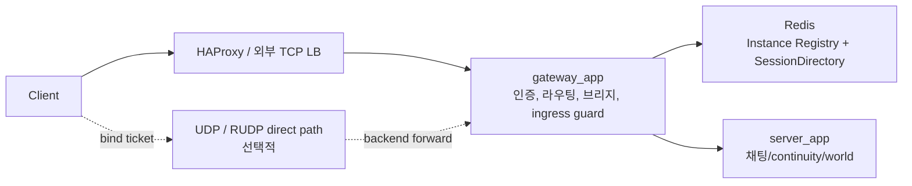

# 게이트웨이 아키텍처 심층 설명

이 문서는 `gateway_app`이 왜 별도 프로세스로 존재하는지, 어떤 책임만 가져야 하는지, 그리고 왜 그 경계가 운영과 유지보수에 중요한지를 설명한다.

간단한 모듈 소개는 [README.md](./README.md), 운영 관점의 HAProxy 연동은 [docs/ops/gateway-and-lb.md](../docs/ops/gateway-and-lb.md), 설정 값은 [docs/configuration.md](../docs/configuration.md)를 우선 본다. 이 문서는 그보다 더 깊게 "왜 이런 구조여야 하는가"를 다룬다.

## 1. gateway_app은 무엇인가

`gateway_app`은 클라이언트가 처음 붙는 엣지 프로세스(edge process)다. 하지만 여기서 중요한 점은 "작은 서버"가 아니라 "연결과 라우팅을 위한 전용 경계"라는 것이다.

이 프로세스가 맡는 핵심 책임은 다음과 같다.

- TCP 클라이언트 연결 수락
- 인증 수행 또는 인증 모듈 위임
- 적절한 backend `server_app` 선택
- 클라이언트 <-> backend 브리지 유지
- direct transport(UDP/RUDP) 진입 게이트와 방어선 제공
- readiness, ingress 제한, circuit breaker 같은 보호 장치 제공

반대로 gateway가 의도적으로 소유하지 않는 것은 다음이다.

- 방 상태, 유저 상태, 채팅 규칙
- world continuity 판단의 최종 의미
- DB 영속화
- Redis fanout payload의 해석

즉, gateway는 "게임/채팅 로직을 처리하는 서버"가 아니라 "클라이언트 연결을 안전하게 backend까지 운반하는 프런트 레이어"다.

## 2. 왜 gateway를 별도 프로세스로 두는가

이 질문이 가장 중요하다. 초보자는 종종 "어차피 backend 서버가 있는데 왜 한 단계를 더 두나?"라고 생각한다. 이유는 명확하다.

### 이유 1. 엣지 트래픽 문제와 비즈니스 문제를 분리하기 위해

클라이언트가 붙는 첫 구간에서는 다음 같은 문제가 자주 생긴다.

- 인증 실패 스파이크
- 재접속 폭주
- 느린 backend connect
- send queue overflow
- direct transport bind abuse

이 문제들은 채팅 로직과는 성격이 다르다. 같은 프로세스에서 모두 처리하면 ingress 방어와 비즈니스 로직이 서로를 오염시킨다.

### 이유 2. backend를 교체하거나 늘릴 때 클라이언트 진입점을 안정적으로 유지하기 위해

`server_app`은 world owner, continuity, write-behind, Redis 의존성을 함께 가진다. 이 backend를 수평 확장하거나 drain 할 때, 클라이언트가 바라보는 진입점은 최대한 단순해야 한다. gateway를 두면 backend가 바뀌어도 클라이언트는 같은 ingress 계약만 보면 된다.

### 이유 3. 과부하 제어를 edge에서 먼저 걸기 위해

connect timeout, retry budget, token bucket, circuit breaker를 backend 안에서만 처리하면 이미 너무 늦을 수 있다. gateway에서 먼저 걸러야 backend 전체가 같이 무너지지 않는다.

즉, gateway 분리는 계층을 늘리기 위한 취향이 아니라, 엣지 방어와 제품 로직을 분리하기 위한 구조적 필요다.

## 3. gateway의 현재 구성

현재 gateway는 크게 세 층으로 본다.

### 3.1 `GatewayApp`

프로세스 수명주기와 전체 정책을 소유한다.

- 환경 변수 로딩
- readiness/metrics
- backend selector
- circuit breaker
- ingress token bucket
- UDP/RUDP feature gate

### 3.2 `GatewayConnection`

클라이언트 한 연결을 담당한다.

- 초기 인증 처리
- backend 선택 요청
- session별 상태 관리
- client -> backend payload 중계
- UDP bind ticket 발급 시작점

### 3.3 `BackendConnection`

실제 backend `server_app` 연결을 담당한다.

- resolve/connect
- connect timeout
- bounded send queue
- write/read loop
- retry/backoff

이 분리가 중요한 이유는, 클라이언트 측 책임과 backend 측 책임이 다르기 때문이다. 둘을 한 클래스에 몰아넣으면 connect 실패, retry, client close, backend close가 뒤엉켜 장애 원인을 추적하기 어렵다.

## 4. 가장 중요한 책임: backend 선택

gateway는 Redis를 이용해 backend를 고른다. 여기서 현재 구조의 핵심은 sticky routing과 least-connections를 함께 쓰는 점이다.

### 4.1 왜 sticky routing이 필요한가

이미 세션이 특정 backend에 붙어 있던 사용자는 가능하면 같은 backend로 돌아가는 편이 좋다.

이유:

- continuity 복구가 쉬워진다
- warm state를 다시 찾기 쉽다
- 재접속 시 불필요한 상태 재구성이 줄어든다

sticky가 없으면 사용자가 끊겼다가 다시 붙을 때마다 backend가 바뀔 수 있고, 그러면 continuity 비용이 커지거나 세션 경험이 불안정해진다.

### 4.2 왜 least-connections도 같이 필요한가

sticky만 있으면 장기적으로 부하가 한쪽 backend에 계속 쌓일 수 있다. 새 사용자까지 sticky만 따라가면 특정 서버가 과열되고, 나머지 backend는 놀 수 있다.

그래서 바인딩이 없거나 만료된 경우에는 `active_sessions` 기준으로 가장 여유 있는 backend를 고른다.

### 4.3 왜 `SessionDirectory`는 core가 아니라 gateway 소유인가

`SessionDirectory`는 공용 instance discovery가 아니라 "이 gateway가 sticky session을 어떻게 유지할 것인가"라는 배치 전략이다.

즉 이것은:

- Redis key schema
- L1 cache + Redis(L2) 조합
- refresh/release 타이밍

같은 운영 정책을 포함한다.

이걸 core public surface로 올리면 모든 consumer가 같은 sticky 전략을 따라야 하는 것처럼 굳어 버린다. 그래서 current-state에서는 `gateway/`가 소유하는 편이 맞다.

## 5. 왜 gateway는 브리지여야 하는가

gateway는 payload를 해석하기보다 backend로 안전하게 운반하는 데 집중한다.

### 그 이유

- 비즈니스 규칙이 gateway에 들어오면 `server_app`과 로직이 중복된다.
- protocol evolution 때 gateway와 server를 동시에 더 크게 건드려야 한다.
- direct transport와 TCP fallback 판단이 애플리케이션 로직에 오염된다.

현재 구조는 그래서 "L7에 가까운 앱별 라우터"가 아니라 "정책을 가진 브리지"에 가깝다.

브리지 구조의 장점:

- backend를 교체해도 ingress 경계가 비교적 안정적이다.
- gateway는 connect/read/write, retry, overflow 같은 transport 문제에 집중한다.
- chat/world/fanout 규칙은 backend 한 곳에서만 바꿔도 된다.

즉, gateway는 똑똑한 비즈니스 서버가 아니라, 똑똑한 연결 관리자여야 한다.

## 6. 과부하와 장애를 어떻게 막는가

gateway 설계에서 가장 실용적인 부분이다. 현재 구조는 "문제가 생기면 되도록 빨리 거절하고, 이유를 메트릭으로 남긴다"는 철학을 가진다.

### 6.1 backend connect timeout

`GATEWAY_BACKEND_CONNECT_TIMEOUT_MS`가 필요한 이유는, backend 연결이 느릴 때 session이 무한정 매달리는 것을 막기 위해서다.

이 값이 없으면:

- 느린 backend connect가 클라이언트 체감 지연으로 곧바로 번지고
- 연결이 쌓이며 메모리와 소켓이 낭비되고
- 어느 시점에는 gateway 전체가 느려진다

### 6.2 bounded send queue

`GATEWAY_BACKEND_SEND_QUEUE_MAX_BYTES`는 backend 쪽이 느릴 때 메모리가 끝없이 늘어나는 것을 막는다.

이 제한이 없으면 overflow는 보이지 않게 누적되고, 결국 tail latency 급증이나 OOM으로 끝난다. 현재 구조는 overflow를 명시적 실패와 counter로 드러내므로 운영자가 증상을 빨리 볼 수 있다.

### 6.3 retry budget과 backoff

재시도는 필요하지만 무제한 재시도는 장애를 더 크게 만든다. 현재 gateway는 분당 예산과 지수 증가 backoff를 둔다.

이렇게 해야:

- backend 장애 중에도 gateway가 자기 자신을 보호할 수 있고
- 계속 실패하는 세션 때문에 전체 연결 자원이 잠식되지 않으며
- 운영자는 retry exhaustion을 메트릭으로 관측할 수 있다

### 6.4 circuit breaker

circuit breaker는 "지금 backend connect를 더 시도하는 것이 해롭다"는 상황을 명시적으로 표현한다.

없으면 gateway는 backend 장애 중에도 계속 connect를 때리며, 느린 실패를 대량 생산한다. circuit open 상태는 빠른 거절을 만들고, backend가 회복할 시간을 번다.

### 6.5 ingress admission

gateway는 ready 상태, rate limit, active session 상한, circuit open 상태를 보고 신규 연결을 받을지 결정한다.

이 admission 계층이 중요한 이유는, 시스템이 이미 버거운 상황에서 새 연결을 계속 받는 것이 "친절한 서비스"가 아니라 "더 큰 장애"가 되기 때문이다.

즉, gateway는 많이 받는 것보다 "받을 수 있을 때만 받는 것"이 더 중요하다.

## 7. direct transport: UDP / RUDP는 왜 이렇게 보수적인가

gateway는 TCP만이 아니라 direct transport 진입 경계도 담당한다. 하지만 current-state는 매우 보수적인 게이트를 둔다.

### 7.1 왜 bind ticket이 필요한가

UDP는 연결 개념이 약하기 때문에, 임의 endpoint가 "내가 저 세션이다"라고 주장하기 쉽다. bind ticket은 TCP로 이미 확인된 세션에게만 UDP 바인딩 권한을 준다.

없으면:

- 세션 스푸핑 위험이 커지고
- 임의 endpoint가 direct path를 점유할 수 있으며
- replay/reorder/abuse 대응이 훨씬 어려워진다

### 7.2 왜 allowlist가 필요한가

모든 opcode를 UDP/RUDP에 바로 태우면 안 된다. 어떤 메시지는 순서 보장이 반드시 필요하고, 어떤 메시지는 backend가 아직 direct path를 준비하지 않았을 수 있다.

allowlist는 transport를 정책으로 명시한다. 그렇지 않으면 "실험 중인 direct path"가 어느새 전체 프로토콜 계약을 뒤흔들 수 있다.

### 7.3 왜 abuse guard와 retry backoff가 필요한가

bind 실패가 반복되는 endpoint는 의도적 탐색이거나 잘못된 클라이언트일 수 있다. fail window, block time, retry backoff를 두는 이유는 UDP ingress가 손쉬운 증폭 지점이 되지 않게 하기 위해서다.

### 7.4 왜 RUDP는 canary/fallback 중심인가

current-state의 RUDP는 "기본 경로를 완전히 대체하는 완성형 전송"보다, 제한된 비율과 allowlist 안에서 실험적으로 확대하는 구조다.

이 방식이 좋은 이유는:

- direct transport 품질을 단계적으로 검증할 수 있고
- handshake/inflight 문제 시 TCP fallback이 가능하며
- 전체 서비스 안정성을 해치지 않고 rollout할 수 있기 때문이다

즉, gateway의 direct transport는 공격적인 성능 기능이 아니라, 점진적 rollout을 위한 운영형 구조다.

## 8. readiness와 메트릭이 왜 gateway에서 특히 중요한가

gateway는 스택에서 가장 바깥쪽에 있으므로, 여기서의 잘못된 상태 노출은 곧바로 사용자 체감으로 이어진다.

현재 메트릭이 중요한 이유:

- `gateway_backend_*`
  - backend connect, write, queue overflow, circuit 상태를 보여 준다
- `gateway_ingress_reject_*`
  - 왜 신규 연결이 차단되는지 보여 준다
- `gateway_udp_*`, `gateway_rudp_*`
  - direct transport 실험이 실제로 어떻게 동작하는지 보여 준다

이 지표가 없으면 운영자는 "로그인 실패가 인증 때문인지, backend connect timeout인지, circuit open 때문인지"를 분리하기 어렵다.

즉, gateway는 edge이기 때문에 관측성이 특히 더 중요하다.

## 9. 초보자가 헷갈리기 쉬운 ownership 규칙

### 규칙 1. gateway는 방 상태를 소유하지 않는다

방 사용자 목록, world continuity, fanout 규칙은 `server_app`의 책임이다. gateway가 그 상태를 캐시하고 판단하기 시작하면 두 군데 상태가 생기고 일관성이 깨진다.

### 규칙 2. sticky 전략은 공용 contract가 아니라 gateway 운영 정책이다

`InstanceRecord`와 selector는 공용 seam에 가깝지만, `SessionDirectory`는 gateway-specific policy다. 둘을 혼동하면 core/public boundary를 잘못 넓히게 된다.

### 규칙 3. direct transport 기능을 확대할 때도 TCP fallback을 먼저 생각해야 한다

UDP/RUDP는 빠를 수 있지만, 장애 시 fallback이 준비되지 않으면 edge 전체가 불안정해진다. gateway는 실험 기능보다 안정적 ingress가 우선이다.

## 10. 정리

`gateway_app`의 현재 설계는 다음 한 문장으로 요약할 수 있다.

클라이언트 ingress를 backend 비즈니스 로직과 분리하고, 그 사이에서 라우팅·보호·점진적 direct transport 게이트를 담당하는 엣지 프로세스다.

이 구조가 필요한 이유는:

- 엣지 트래픽 문제와 제품 로직을 분리하기 위해
- sticky continuity와 load distribution을 동시에 맞추기 위해
- connect timeout, overflow, retry storm를 edge에서 먼저 막기 위해
- UDP/RUDP 같은 direct path를 안전하게 rollout하기 위해

따라서 gateway를 바꿀 때 가장 먼저 던져야 할 질문은 "이 변경이 backend 비즈니스 로직을 침범하는가?"와 "이 변경이 edge 보호 장치를 약하게 만드는가?"다. 현재 구조는 그 두 질문에 일관되게 답하도록 만들어져 있다.
