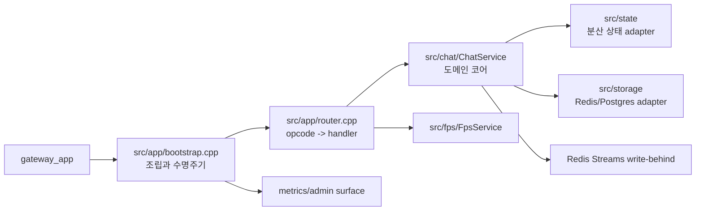

# 서버 아키텍처 심층 설명

이 문서는 `server_app`이 현재 어떤 책임을 가지고 있는지, 왜 그 책임이 `core/`가 아니라 `server/`에 남아 있는지, 그리고 요청 처리와 운영 경계가 왜 지금 구조여야 하는지를 설명한다.

빠른 개요는 [README.md](./README.md), core와의 관계는 [docs/core-design.md](../docs/core-design.md), core 배경은 [docs/core-architecture-rationale.md](../docs/core-architecture-rationale.md)를 먼저 본다. 이 문서는 `server_app` 자체를 더 자세히 해설하는 current-state 안내서다.

## 1. `server_app`은 무엇인가

`server_app`은 단순한 채팅 핸들러 모음이 아니다. 현재 이 프로세스는 core 위에 올라가는 대표 앱이며, 다음 책임을 한곳에서 조합한다.

- 로그인, 방 입장/퇴장, 채팅, 귓속말 같은 비즈니스 로직
- 세션 연속성(session continuity)
- world residency, world migration payload 소비
- Redis fanout과 분산 상태 연동
- write-behind 이벤트 생산자 역할
- FPS fixed-step substrate의 실제 앱 소비자

즉, core가 "여러 앱이 공유하는 플랫폼"이라면 `server_app`은 "그 플랫폼을 이용해 실제 제품 동작을 만드는 애플리케이션"이다.

## 2. 왜 core가 있는데도 `server_app`이 두꺼운가

이 질문이 중요하다. 초보자는 종종 "공용 core가 있으면 앱은 얇아야 하지 않나?"라고 생각한다. 하지만 앱은 얇기보다 경계가 분명해야 한다.

### core가 가져야 하는 것

- lifecycle, transport substrate, dispatch 정책, metrics, extensibility mechanism

### server가 가져야 하는 것

- 채팅 도메인 규칙
- Redis/Postgres 실제 조합
- continuity world ownership 해석
- room state와 사용자 상태
- 어떤 이벤트를 write-behind로 보낼지 결정하는 정책

이 분리를 하지 않으면 core가 채팅 앱에 종속되고, public package가 곧 채팅 구현이 된다. 따라서 `server_app`이 어느 정도 두꺼운 것은 나쁜 것이 아니라, core 경계를 지키기 위한 결과다.

## 3. 현재 구조를 층별로 보기

### 3.1 `src/app/`

프로세스 조립과 운영 규약을 맡는다.

- 설정 로드
- `EngineRuntime` 조립
- listener, scheduler, worker, metrics server 기동
- fanout 구독
- shutdown step 등록

여기서 중요한 점은 bootstrap이 도메인 처리까지 하지는 않는다는 것이다. bootstrap은 "무엇을 어떤 순서로 붙일지"를 결정하지만, "채팅 규칙이 무엇인지"는 모른다.

### 3.2 `src/chat/`

실제 제품 동작의 중심이다.

- 로그인/입장/채팅/퇴장 handler
- 세션 상태
- 방 상태
- continuity lease 발급과 복구
- fanout 발행/수신 처리
- write-behind 이벤트 생산
- plugin/Lua cold hook 소비

### 3.3 `src/state/`

분산 상태용 concrete adapter를 둔다.

예를 들어 instance registry, continuity 관련 Redis 조회/저장은 앱 의미를 포함할 수 있다. 이런 구현까지 core stable surface로 올리면 공용 계약이 구체적인 Redis 운영 전략에 묶인다.

### 3.4 `src/storage/`

Redis/Postgres concrete adapter, repository, connection pool 조합을 둔다. core는 generic execution seam만 공개하고, 실제 도메인 저장 구조는 server가 소유한다.

## 4. 부트스트랩이 왜 중요한가

`server_app`의 bootstrap은 단순 초기화 코드가 아니라, 런타임의 소유권과 종료 순서를 정의하는 장소다.

### 왜 조립 순서가 중요한가

다음 구성 요소는 서로 의존한다.

- acceptor와 session
- Redis client와 fanout subscription
- DB worker와 repository pool
- Lua/plugin runtime
- metrics/admin HTTP

이들을 임의 순서로 붙이거나 끊으면:

- readiness가 아직 false여야 할 때 true가 될 수 있고
- 종료 중에 새 연결을 받아 drain이 길어질 수 있으며
- worker가 멈춘 뒤에도 domain code가 enqueue를 시도할 수 있다

그래서 bootstrap은 단순한 "main 함수 정리"가 아니라 운영 일관성을 보장하는 조립 지점이다.

### 왜 shutdown step을 명시적으로 등록하는가

종료는 시작보다 더 쉽게 망가진다. 현재 `server_app`은 drain과 자원 정리 순서를 명시한다.

- readiness를 내린다
- acceptor를 막는다
- active session을 drain한다
- worker/scheduler/pubsub를 순서대로 정리한다

이 순서가 없으면 종료 중에도 새 트래픽이 들어오거나, 아직 처리할 이벤트가 남았는데 worker가 먼저 내려갈 수 있다. 결국 graceful shutdown이 아니라 "운 좋게 종료되면 다행" 수준이 된다.

## 5. 요청 처리는 왜 `Dispatcher + ChatService` 구조인가

### 5.1 `Dispatcher`가 라우팅만 맡는 이유

`Dispatcher`는 opcode와 `OpcodePolicy`를 보고 handler로 넘긴다. 여기서 중요한 것은 정책과 비즈니스 로직이 분리된다는 점이다.

이렇게 해야:

- 어떤 메시지가 어떤 실행 위치에서 도는지 한눈에 보이고
- transport 정책과 도메인 처리 로직이 섞이지 않으며
- 예외를 세션 단위 실패로 흡수하기 쉽다

### 5.2 왜 `ChatService`가 아직 중심인가

현재 `ChatService`는 큰 클래스다. 이것만 보면 모놀리식해서 나빠 보일 수 있다. 하지만 현재 구조에서는 "채팅 제품의 일관된 도메인 규칙을 한 곳에서 유지"하는 장점이 더 크다.

`ChatService`가 중심이어야 하는 이유:

- 로그인, 방 입장, fanout, continuity, write-behind가 같은 세션 상태를 본다.
- 이 규칙이 여러 서비스로 과하게 쪼개지면 state ownership이 흔들린다.
- 분산 상태와 로컬 메모리 상태의 경계가 한 눈에 보이는 편이 유지보수에 낫다.

즉, 지금의 핵심 문제는 "클래스를 더 많이 나누는 것"보다 "무슨 상태를 누가 소유하는지 명확하게 유지하는 것"이다.

## 6. 비즈니스 로직의 중요한 특징

### 6.1 continuity가 왜 핵심인가

current-state의 `server_app`은 단순 채팅 서버를 넘어 continuity를 수행한다.

- logical session lease 발급
- world ownership 저장
- world migration envelope 해석
- fallback world 결정

이 로직이 중요한 이유는, 사용자가 재접속할 때 같은 backend나 같은 world 의미를 유지해야 하기 때문이다. 이 기능이 없으면 gateway sticky만으로는 충분하지 않고, backend 쪽에서 continuity를 복원할 수 없다.

### 6.2 world residency를 왜 server가 해석하는가

core는 `worlds/**`에 vocabulary를 제공하지만, "현재 앱에서 이 migration payload를 어떻게 room handoff로 해석할 것인가"는 여전히 server 책임이다.

이렇게 남겨 둔 이유:

- app마다 migration payload 의미가 다를 수 있고
- core가 채팅 room semantics까지 알면 domain-neutral하지 않으며
- continuity fallback 정책은 제품 UX와 직접 연결되기 때문이다

즉, server는 core contract를 소비하되, 최종 의미 해석은 앱에서 한다.

### 6.3 fanout을 왜 server가 소유하는가

Redis fanout은 분산 알림 메커니즘이지만, 어떤 채널을 쓰고 어떤 payload를 어떻게 해석할지는 채팅 도메인 규칙이다.

이를 core로 올리면:

- channel naming이 public contract처럼 굳고
- whisper, refresh, admin moderation 같은 앱 의미가 core에 스며든다

그래서 fanout substrate는 공용 Redis client 위에 놓이더라도, 채널 의미와 payload 처리 로직은 server 소유가 맞다.

## 7. write-behind를 왜 server가 "생산"만 하는가

`server_app`은 write-behind 이벤트 생산자다. 실제 DB 반영은 `wb_worker`가 한다.

이 분리가 좋은 이유:

- request path가 DB latency를 직접 기다리지 않아도 된다
- 서버는 제품 이벤트를 기록하는 데 집중하고, worker는 영속화 안정성에 집중할 수 있다
- 장애 시 원인을 "생산 문제"와 "소비/DB 문제"로 나눠 볼 수 있다

반대로 서버 안에서 바로 DB write를 수행하면, 느린 DB가 곧 로그인/채팅 latency로 번진다. 분산 시스템에서 이 coupling은 운영상 가장 흔한 병목 원인 중 하나다.

## 8. plugin / Lua가 왜 앱 안에서 의미를 가진 채 소비되는가

core는 plugin host와 Lua runtime 메커니즘을 제공한다. 하지만 chat hook ABI, admin command hook, Lua host function은 `server_app`이 제공한다.

이렇게 해야:

- core는 재사용 가능한 메커니즘으로 남고
- 채팅 제품의 규칙은 server가 계속 조정할 수 있으며
- 다른 앱이 같은 메커니즘을 다른 의미로 재사용할 수 있다

즉, 메커니즘은 core, 의미는 앱이라는 분업이 유지된다.

## 9. 운영 측면에서 server가 특히 신경 쓰는 부분

### 9.1 shutdown drain

서버는 세션을 많이 들고 있기 때문에 종료 품질이 중요하다.

- readiness를 늦게 내리면 ingress가 계속 새 연결을 보낸다
- drain timeout이 없으면 종료가 끝나지 않을 수 있다
- forced close counter가 없으면 운영자는 종료 품질을 측정할 수 없다

따라서 drain은 단순 예절이 아니라 운영 계약이다.

### 9.2 metrics

`server_app` 메트릭은 단순 요청 수보다 "어떤 fallback이 일어났는가"를 보여 주는 데 가치가 있다.

예:

- continuity world restore/fallback 계열
- shutdown drain 계열
- fanout 및 분산 상태 실패 경로

초보자는 종종 throughput만 보지만, 실제 운영에서는 fallback counter와 failure reason이 훨씬 중요하다. 이유는 장애가 생겼을 때 어디서 degrade됐는지 바로 알려 주기 때문이다.

## 10. 초보자가 특히 조심해야 할 ownership 규칙

### 규칙 1. 채팅 규칙이 재사용돼 보인다고 바로 core로 올리지 않는다

재사용 가능한 것처럼 보여도 room semantics, continuity fallback, admin moderation은 제품 정책이다. 섣불리 core로 올리면 domain-neutral contract가 무너진다.

### 규칙 2. bootstrap에 비즈니스 로직을 넣지 않는다

bootstrap은 조립과 수명주기, configuration wiring을 맡아야 한다. 거기에 handler 의미가 섞이면 초기화 순서와 도메인 규칙이 한 파일에서 엉킨다.

### 규칙 3. persistence 전략과 request path를 다시 강하게 결합하지 않는다

write-behind를 우회해서 handler에서 직접 무거운 DB 작업을 늘리기 시작하면, 현재 구조가 얻은 latency 완충 효과가 사라진다.

## 11. 정리

`server_app`의 현재 구조는 "core 위의 두꺼운 앱"이 아니라, "공용 플랫폼과 제품 규칙을 올바르게 분리한 앱"이라고 보는 편이 정확하다.

이 구조가 좋은 이유는:

- 공용 runtime 규약은 core에 남기고
- 제품 의미와 도메인 상태는 server에 남기며
- 분산 상태, continuity, write-behind, extensibility를 한곳에서 일관되게 해석할 수 있기 때문이다

따라서 `server_app`을 바꿀 때 가장 먼저 봐야 할 것은 "이 로직이 domain policy인가, 공용 runtime contract인가"다. 그 구분이 흔들리면 core와 server의 경계가 같이 무너진다.
