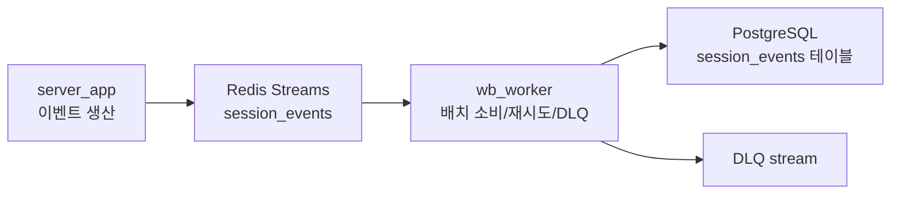

# 쓰기 지연(write-behind) 심층 설명

이 문서는 현재 저장소의 write-behind 경로가 왜 이렇게 생겼는지, 왜 단순한 `XADD -> INSERT`보다 훨씬 많은 보호 장치를 가지는지, 그리고 운영자가 어디를 먼저 봐야 하는지를 설명한다.

빠른 개요는 [tools/wb_worker/README.md](../tools/wb_worker/README.md), 운영/구성 관점은 [docs/db/write-behind.md](../docs/db/write-behind.md), 설정 값은 [docs/configuration.md](../docs/configuration.md)를 우선 본다. 이 문서는 그 구조적 배경을 자세히 풀이한다.

## 1. 문제 정의: 왜 요청 경로(request path)에서 DB를 직접 기다리면 안 되는가

채팅 서버에서 로그인, 입장, 퇴장, 세션 종료 같은 이벤트는 자주 발생한다. 이때 every request가 즉시 PostgreSQL round-trip을 기다리면 다음 문제가 생긴다.

- DB가 순간적으로 느려질 때 사용자 체감 지연이 바로 늘어난다
- DB 장애가 곧 로그인/세션 처리 장애로 번진다
- 짧은 스파이크도 backend 전체 tail latency를 밀어 올린다

즉, 영속화가 중요하다고 해서 요청 경로와 같은 타이밍에 같은 프로세스에서 처리하는 것은 항상 좋은 선택이 아니다.

write-behind는 이 coupling을 완화한다.

- `server_app`은 이벤트를 안정적으로 생산한다
- `wb_worker`는 배치 단위로 DB에 적재한다

이 구조가 주는 핵심 이점은 "사용자 응답성과 DB 처리 속도를 느슨하게 분리"할 수 있다는 점이다.

## 2. 현재 구조에서 누가 무엇을 책임지는가

### 2.1 `server_app`

- 어떤 이벤트를 write-behind로 보낼지 결정한다
- `emit_write_behind_event()`로 Redis Stream에 기록한다
- tracing 상관키가 있으면 함께 싣는다
- 요청 경로에서는 DB 적재 완료를 기다리지 않는다

### 2.2 `wb_worker`

- consumer group으로 stream을 읽는다
- 배치 조건을 만족하면 flush를 시도한다
- 1 배치를 1 트랜잭션으로 처리한다
- 엔트리 단위 실패는 savepoint로 격리한다
- 성공 시 ACK, 실패 시 DLQ/재시도/보류 정책을 적용한다
- DB 장애 시 reconnect backoff와 readiness 제어를 맡는다

이 분리가 필요한 이유는, 생산자와 소비자가 신경 써야 할 실패 모드가 다르기 때문이다.

- 생산자는 "사용자 요청을 느리게 만들지 않기"가 핵심이다.
- 소비자는 "느리더라도 잃지 않고, 운영자가 상태를 추적할 수 있게 하기"가 핵심이다.

## 3. 생산자 경로: 왜 `server_app`은 여기까지만 책임지는가

`ChatService::emit_write_behind_event()`는 현재 서버에서 write-behind의 진입점이다.

### 생산자가 하는 일

- `WRITE_BEHIND_ENABLED`를 확인한다
- `REDIS_STREAM_KEY` 기준으로 이벤트를 쓴다
- 필요하면 `REDIS_STREAM_MAXLEN` 기준 trim을 적용한다
- `trace_id`, `correlation_id` 같은 상관키를 싣는다

### 생산자가 하지 않는 일

- DB 스키마별 세부 분기
- 트랜잭션 retry
- DLQ 처리
- pending reclaim

이렇게 나눈 이유는, 생산자가 영속화 세부 정책까지 알기 시작하면 요청 경로가 다시 무거워지기 때문이다. 생산자는 "이벤트를 안전하게 스트림에 올리는 것"까지만 책임져야 한다.

### 왜 일부 이벤트만 write-behind로 보내는가

모든 상태 변경을 무조건 write-behind로 보내는 것은 아니다. 어떤 이벤트는 즉시 로컬/Redis 상태만으로 충분하고, 어떤 이벤트만 장기 감사나 DB 조회를 위해 적재할 가치가 있다.

즉, write-behind는 "모든 것을 비동기로 미루는 패턴"이 아니라, "DB에 늦게 반영해도 되는 이벤트를 식별해서 분리하는 패턴"이다.

## 4. Redis Streams를 중간 버퍼로 쓰는 이유

단순 큐보다 Streams가 유리한 이유는 다음과 같다.

- consumer group 기반 병렬 소비가 가능하다
- pending entry list(PEL)로 미처리 항목을 추적할 수 있다
- `XAUTOCLAIM`으로 끊긴 consumer의 작업을 회수할 수 있다
- event id를 자연스러운 멱등성 키로 활용할 수 있다

리스트(List)나 메모리 큐만 쓰면 worker 장애 시 "누가 처리 중이었는지"와 "무엇이 아직 안 끝났는지"를 추적하기 어렵다. Streams는 운영형 소비자에 필요한 회수(reclaim)와 관측을 기본 도구로 제공한다.

## 5. 소비자 경로: 왜 `wb_worker`가 이렇게 복잡한가

초보자가 보기에는 `wb_worker`가 과하게 복잡해 보일 수 있다. 하지만 대부분은 장애 시 안전장치다.

### 5.1 consumer group을 쓰는 이유

`XREADGROUP`은 단순 구독이 아니라 "이 항목을 지금 누가 맡았는지"를 명시한다. 이 정보가 있어야 worker가 죽었을 때 다른 소비자가 남은 항목을 회수할 수 있다.

### 5.2 배치 조건이 세 개인 이유

현재 flush는 보통 다음 기준을 함께 본다.

- 최대 이벤트 수
- 최대 바이트 수
- 최대 대기 시간

하나만 보면 문제가 생긴다.

- 이벤트 수만 보면 큰 payload 배치가 너무 무거워질 수 있다
- 바이트만 보면 작은 이벤트가 너무 오래 지연될 수 있다
- 시간만 보면 DB round-trip이 너무 많아질 수 있다

즉, 세 조건을 함께 보는 것은 지연과 효율을 동시에 맞추기 위한 균형 장치다.

### 5.3 왜 1 배치 = 1 트랜잭션인가

배치의 장점은 DB round-trip을 줄이는 것이다. 하지만 한 이벤트마다 별도 트랜잭션을 열면 write-behind의 의미가 크게 줄어든다.

그렇다고 전체 배치를 "무조건 전부 성공해야만 하는 단일 덩어리"로 만들면, 한 엔트리 오류가 배치 전체를 막을 수 있다. 그래서 current-state worker는:

- 배치 전체는 1 트랜잭션으로 묶되
- 엔트리 단위 savepoint로 실패를 격리한다

이 방식은 throughput과 실패 격리 사이의 현실적인 타협이다.

## 6. 왜 exactly-once를 직접 약속하지 않는가

현재 경로는 at-least-once에 가깝다.

- commit 성공 후 ACK 한다
- 중복 적재 가능성은 `event_id` unique + `ON CONFLICT DO NOTHING`으로 무해화한다

이 구조를 택한 이유는, 분산 시스템에서 exactly-once를 엄밀히 약속하려면 비용과 복잡도가 크게 뛰기 때문이다. 반면 at-least-once + 멱등 삽입은 구현과 운영 복잡도를 비교적 낮게 유지하면서 실용적인 안정성을 준다.

즉, 중요한 것은 "절대 한 번만"보다 "중복이 생겨도 결과가 틀어지지 않게" 만드는 것이다.

## 7. 실패 처리가 왜 여러 단계로 나뉘는가

write-behind의 진짜 핵심은 성공 경로보다 실패 경로다.

### 7.1 flush retry budget

일시적 DB 오류는 바로 한 번 더 시도해 볼 가치가 있다. 하지만 무제한 retry는 worker를 영원히 한 배치에 묶어 두고, backlog를 끝없이 키운다.

그래서 retry 예산이 필요하다.

- 잠깐의 오류는 흡수한다
- 지속 장애는 명시적으로 다른 경로(DLQ, reclaim, reconnect backoff)로 넘긴다

### 7.2 DLQ가 왜 필요한가

실패한 이벤트를 그냥 버리면 운영자는 "무엇이 사라졌는지"조차 모른다. DLQ(dead-letter queue)는 실패 이벤트를 별도 분석 대상으로 남겨 준다.

운영상 좋은 이유:

- 재처리가 가능하다
- 특정 payload만 반복 실패하는지 분리할 수 있다
- DB 장애와 데이터 품질 문제를 구분하기 쉽다

### 7.3 `WB_ACK_ON_ERROR`가 왜 위험한가

실패했는데도 ACK하면 pending 적체는 줄지만, 해당 이벤트는 스트림에서 더 이상 재시도되지 않는다.

따라서 `WB_DLQ_ON_ERROR=0`과 `WB_ACK_ON_ERROR=1` 조합은 사실상 드롭(drop)에 가깝다. 이 조합이 왜 위험한지를 문서와 로그에서 계속 강조하는 이유가 여기에 있다.

### 7.4 reclaim이 왜 필요한가

worker 프로세스가 죽거나 네트워크가 끊기면, 이미 가져갔지만 아직 ACK하지 못한 항목이 PEL에 남는다. reclaim이 없으면 이런 항목이 영원히 보류될 수 있다.

`XAUTOCLAIM`은 이를 회수해 다른 소비자가 다시 처리하게 한다. 즉 reclaim은 선택적 최적화가 아니라 "consumer crash 이후에도 파이프라인이 스스로 회복되게 하는 장치"다.

## 8. DB reconnect backoff와 readiness가 왜 같이 가는가

DB가 아예 안 붙는 상황에서 worker가 계속 즉시 재시도하면 두 가지가 나빠진다.

- 로그와 CPU가 쓸데없이 폭주한다
- 운영자는 worker가 실제로 건강한지 판단하기 어렵다

그래서 current-state worker는:

- 지수 백오프(full jitter 포함)에 가깝게 재연결을 시도하고
- 그동안 readiness를 `false`로 둔다

이 구조가 좋은 이유는, "문제가 있다"는 사실을 운영 plane에 명확히 드러내면서도, 장애를 더 키우지 않기 때문이다.

## 9. 메트릭을 왜 이렇게 많이 두는가

write-behind는 문제 원인이 다양하다.

- Redis ingest는 되는데 DB commit이 안 되는가
- pending이 쌓이는데 reclaim이 안 되는가
- retry 예산이 소진되는가
- DLQ가 늘어나는가
- reconnect backoff가 길어지는가

그래서 `wb_*` 메트릭은 단순 처리량보다 "어디서 막히는가"를 보여 주는 데 초점이 있다.

운영자가 우선 보는 항목은 보통 다음과 같다.

- `wb_pending`
- `wb_flush_*`
- `wb_reclaim_*`
- `wb_db_unavailable_total`
- `wb_db_reconnect_backoff_ms_last`
- `wb_error_drop_total`

이 지표들이 없다면, 운영자는 단순히 "DB 반영이 늦다"는 현상만 보고 어느 지점에서 병목이 생겼는지 추측해야 한다.

## 10. 이 구조의 trade-off

write-behind는 장점만 있는 패턴은 아니다.

### 장점

- 요청 경로 latency를 줄일 수 있다
- DB 스파이크를 배치 처리로 완화할 수 있다
- 생산자와 소비자 장애를 분리해서 볼 수 있다

### 비용

- eventual consistency를 받아들여야 한다
- worker, DLQ, reclaim, retry 같은 운영 복잡도가 늘어난다
- Redis 의존성이 더 중요해진다

즉, 이 구조는 "복잡하지만 더 안전한 운영"을 선택한 결과다. 단순히 구현을 멋있게 만들기 위한 패턴이 아니다.

## 11. 초보자가 특히 조심해야 할 유지보수 규칙

### 규칙 1. 새 이벤트를 추가할 때는 소비자 의미까지 같이 생각한다

생산자에서 `XADD`만 넣고 끝내면 안 된다. 그 이벤트가 DB에서 어떤 멱등성 키를 가지는지, 실패 시 DLQ로 보내도 되는지, 바로 ack해도 되는지 같이 봐야 한다.

### 규칙 2. retry를 늘리는 것이 항상 해결책은 아니다

retry 예산을 키우면 일시적 오류에는 좋을 수 있지만, 지속 장애에서는 backlog만 더 키울 수 있다. retry는 성능 튜닝이 아니라 실패 의미 설계다.

### 규칙 3. "일단 ACK해서 적체를 풀자"는 발상은 조심해야 한다

ACK는 처리 완료 의미에 가깝다. DLQ나 다른 보존 경로 없이 ACK를 늘리면, 운영자는 문제를 늦게 발견하고 데이터는 조용히 사라질 수 있다.

## 12. 정리

현재 저장소의 쓰기 지연 경로는 단순 비동기 큐가 아니다. 그것은:

- request path에서 DB를 떼어 내고
- Redis Streams로 책임을 완충하고
- `wb_worker`가 배치/재시도/DLQ/reclaim/backoff를 맡으며
- 운영자가 실패 위치를 관측할 수 있게 만든 파이프라인이다

따라서 write-behind를 바꿀 때 가장 먼저 봐야 할 질문은 "더 빨라지는가?"보다 "실패했을 때 무엇이 남고, 누가 복구할 수 있는가?"다. 현재 구조는 그 질문에 답하기 위해 지금 모양이 되었다.
